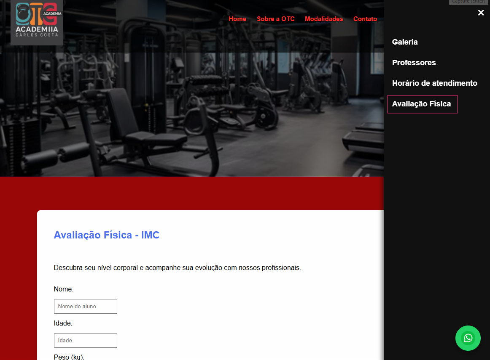

# OTC Academia

Sistema web desenvolvido para uma academia com foco em apresentação institucional e gerenciamento básico de matrículas.

## Principais Funcionalidades

✅ Cadastro de alunos

✅ Avaliação Física IMC

✅ Impressão de avaliação

✅ Consulta automática de CEP

✅ Integração com WhatsApp

✅ Planos de matrícula

✅ Galeria de imagens

✅ Área de professores

✅ Navegação dinâmica em JavaScript

✅ Layout responsivo

---

## Tecnologias utilizadas

- HTML5
- CSS3
- JavaScript
- API ViaCEP

---

## Objetivo

Desenvolver uma solução web para divulgação da academia e facilitar o processo de matrícula dos alunos.

---

## Preview do Sistema

### Home

### Integração com Redes Sociais

### Sistema de Avaliação Física (IMC)

## Autor

William Lopes
